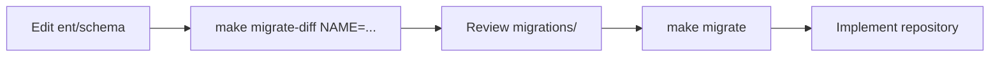

# Radius Backend

Go monolith API for Radius — pragmatic DDD architecture with auth, user management, and SSO (Google/GitHub).

**Local development runs entirely on Docker Compose** (Postgres, Atlas migrations, API with Air hot reload). You do not need Go or Postgres installed on the host.

## Stack

| Component | Technology |
|-----------|------------|
| Runtime | Go 1.26 (inside Docker) |
| HTTP | Echo v4 + Huma v2 (OpenAPI 3.1) |
| Database | PostgreSQL 16 (container) |
| ORM | [Ent](https://entgo.io/) |
| Migrations | [Atlas](https://atlasgo.io/) (`arigaio/atlas` container) |
| Auth | JWT + bcrypt |
| Config | Viper (`RADIUS_*` via `build/.env`) |
| Dev | Docker Compose + Air |

Architecture rules: [`AGENTS.md`](AGENTS.md).

---

## Prerequisites

- [Docker](https://docs.docker.com/get-docker/)
- [Docker Compose](https://docs.docker.com/compose/install/) (v2)

---

## Quick start

```bash
cd build
cp .env.example .env
# Optional: edit .env (JWT secret, OAuth, CORS, etc.)
cd ..
make up
```

`make up` starts the stack in the background, then follows app logs. Press `Ctrl+C` to stop following logs (containers keep running).

| Service | Role |
|---------|------|
| `postgres` | PostgreSQL 16, port `5432` published to host |
| `migrate` | One-shot `atlas migrate apply` on `migrations/` |
| `app` | API on port `8080`, source mounted with Air hot reload |

| Resource | URL |
|----------|-----|
| API | http://localhost:8080 |
| Health | http://localhost:8080/health |
| Docs | http://localhost:8080/docs |
| OpenAPI | http://localhost:8080/openapi.yaml |

---

## Docker commands (Makefile)

All targets use [`build/docker-compose.yml`](build/docker-compose.yml) with `--project-directory build`.

| Command | Description |
|---------|-------------|
| `make up` | Start Postgres + migrate + app, follow app logs |
| `make down` | Stop and remove containers |
| `make logs` | Follow app logs |
| `make restart` | Restart app container |
| `make exec` | Shell into **app** container (`/app` = repo root) |
| `make migrate` | Re-run Atlas migrate apply (migrate container) |
| `make ent-generate` | Regenerate Ent client from `ent/schema/` (app container) |
| `make migrate-diff NAME=...` | Regenerate Ent + create SQL migration (auto `radius_dev` DB) |

Run tests **inside the app container**:

```bash
make exec
go test ./...
```

---

## Configuration

Copy [`build/.env.example`](build/.env.example) to `build/.env`. Compose loads it for all services.

| Variable | Description |
|----------|-------------|
| `RADIUS_APP_ENV` | `development` or `production` (production disables `/docs`) |
| `RADIUS_HTTP_PORT` / `HTTP_PORT` | Host port mapped to API (`8080`) |
| `RADIUS_DATABASE_HOST` | Must be **`postgres`** (Docker service name) |
| `RADIUS_DATABASE_*` | DB user, password, name — must match `DB_*` vars for migrate |
| `RADIUS_JWT_SECRETKEY` | **Required** |
| `RADIUS_JWT_EXPIRY` | e.g. `24h`, `7d` |
| `RADIUS_HTTP_CORS_ALLOWEDORIGINS` | Comma-separated frontend origins |
| `RADIUS_OAUTH_*` | Google/GitHub SSO (empty = disabled) |

Do **not** set `RADIUS_DATABASE_HOST=localhost` when using Compose — the app talks to the `postgres` service on the Docker network.

---

## API endpoints

| Method | Path | Auth | Description |
|--------|------|------|-------------|
| GET | `/health` | — | Liveness |
| POST | `/auth/register` | — | Register + JWT |
| POST | `/auth/login` | — | Login + JWT |
| GET | `/auth/sso/google/url` | — | Google OAuth URL |
| POST | `/auth/sso/google/callback` | — | Google callback |
| GET | `/auth/sso/github/url` | — | GitHub OAuth URL |
| POST | `/auth/sso/github/callback` | — | GitHub callback |
| GET | `/users` | Bearer | List users (paginated) |
| GET | `/users/{id}` | Bearer | User by ID |
| GET | `/users/me` | Bearer | Current user profile |
| PATCH | `/users/me` | Bearer | Update profile |

Auth: `Authorization: Bearer <token>`

**List users** (optional query):

```http
GET /users?page=1&perPage=20&search=john&sortBy=name&sortDir=asc
```

---

## Ent ORM — quick guide

[Ent](https://entgo.io/) defines tables in Go (`ent/schema/`), generates a typed client, and repositories use `*ent.Client` from DI.

### Folder layout

```
ent/schema/          ← edit schema here
ent/client.go        ← generated (do not edit)
ent/user/            ← generated
migrations/          ← Atlas SQL + atlas.sum
```

| Path | Manual edits? |
|------|----------------|
| `ent/schema/` | Yes |
| `ent/*.go` (except `generate.go`) | No — regenerate |
| `migrations/` | Review generated SQL |

### Existing schemas

| Ent schema | Table | Notes |
|------------|-------|-------|
| `User` | `users` | UUID, `citext` email, soft delete |
| `UserOAuthAccount` | `user_oauth_accounts` | FK → users, unique `(provider, provider_user_id)` |

### Regenerate Ent client

After editing `ent/schema/`:

```bash
make ent-generate
```

Air reloads the app when generated files change.

---

## Adding a schema or column (Docker workflow)



`make migrate-diff` runs `ent-generate`, ensures the `radius_dev` database exists, and writes SQL to `migrations/`.

### Step 1 — Define or change schema

Example new file `ent/schema/product.go`:

```go
package schema

import (
	"time"

	"entgo.io/ent"
	"entgo.io/ent/schema/field"
)

type Product struct {
	ent.Schema
}

func (Product) Fields() []ent.Field {
	return []ent.Field{
		field.String("id").Immutable().Unique(),
		field.String("name").NotEmpty(),
		field.Time("created_at").Default(time.Now).Immutable(),
		field.Time("updated_at").Default(time.Now).UpdateDefault(time.Now),
	}
}
```

For new columns on existing schemas, edit the relevant file under `ent/schema/` (e.g. `user.go`).

Tips: see existing `user.go` / `user_oauth_account.go` for `citext`, `edge.To` / `edge.From`, indexes, and CHECK constraints.

### Step 2 — Generate Ent client + SQL migration

One command (Docker only, no manual `ATLAS_DEV_URL`):

```bash
make migrate-diff NAME=add_products_table
```

This will:

1. Run `make ent-generate`
2. Start Postgres (if needed) and create `radius_dev` when missing
3. Write a new file under `migrations/` and update `atlas.sum`

**Review the SQL** before applying to your main database.

### Step 3 — Apply migrations

```bash
make migrate
```

Or restart the full stack (migrate runs automatically before app):

```bash
make down
make up
```

### Step 4 — Repository and domain

1. Domain types/interfaces in `internal/<context>/domain/`
2. Ent repository in `internal/<context>/infrastructure/db/postgres/`
3. Wire in `internal/<context>/module.go`
4. Service + DTO + Huma controller

Keep `ent` types out of `domain/` — map only in infrastructure.

### Reset database

If migrations are out of sync or you need a clean slate:

```bash
make down
docker volume rm radius-backend-dev_postgres-data
make up
```

---

## Docker services overview

```
┌─────────────┐     ┌─────────────┐     ┌─────────────┐
│  postgres   │◄────│   migrate   │     │  (exits)    │
│  :5432      │     │   Atlas     │     └─────────────┘
└──────▲──────┘     └─────────────┘
       │
       │  RADIUS_DATABASE_HOST=postgres
       │
┌──────┴──────┐
│     app     │  :8080 → host, volume mount /app, Air
└─────────────┘
```

- **migrate** image: `arigaio/atlas:latest` (entrypoint `/atlas`)
- **app** image: [`build/Dockerfile`](build/Dockerfile) — Go + Air + Atlas CLI
- Repo root is mounted at `/app` in `app` (live code edits)

---

## Project structure

```
cmd/api/
internal/
  bootstrap/          # Echo, global middleware, register contexts
  module/             # Dependencies (Config, Logger, Ent)
  shared/             # config, database, humaapi, pagination, jwt
  users/              # users bounded context
ent/schema/
migrations/
build/                # Dockerfile, docker-compose.yml, .env
atlas.hcl
```

---

## API documentation

OpenAPI is generated at runtime by Huma (no extra step).

- http://localhost:8080/docs (development only)

---

## Troubleshooting

| Issue | Fix |
|-------|-----|
| `atlas: executable file not found` on migrate | `docker compose -f build/docker-compose.yml --project-directory build pull migrate` |
| Migrate fails, tables already exist | Reset volume: `make down && docker volume rm radius-backend-dev_postgres-data && make up` |
| App cannot connect to DB | Use `RADIUS_DATABASE_HOST=postgres` in `build/.env` |
| Schema changes not visible | `make ent-generate` then `make migrate` |
| Port 8080 in use | Change `HTTP_PORT` / `RADIUS_HTTP_PORT` in `build/.env` |
| `migrate-diff` fails on empty diff | No schema change since last migration — expected |

---

## References

- [Ent docs](https://entgo.io/docs/getting-started)
- [Ent versioned migrations](https://entgo.io/docs/versioned-migrations)
- [Atlas docs](https://atlasgo.io/docs)
- [`AGENTS.md`](AGENTS.md)
