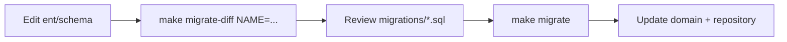

# Ent ORM — Panduan Lengkap (Radius Backend)

Dokumen ini menjelaskan cara menggunakan [Ent](https://entgo.io/) di proyek ini: schema, generate client, migrasi Atlas, repository, dan troubleshooting.

Untuk aturan arsitektur umum (DDD, layer), lihat `[AGENTS.md](../AGENTS.md)`. Untuk quick start Docker, lihat `[README.md](../README.md)`.

---

## Daftar isi

1. [Ringkasan](#ringkasan)
2. [Arsitektur & batas layer](#arsitektur--batas-layer)
3. [Struktur folder](#struktur-folder)
4. [Schema yang ada](#schema-yang-ada)
5. [Perintah Makefile](#perintah-makefile)
6. [Alur kerja harian](#alur-kerja-harian)
7. [Menulis schema Ent](#menulis-schema-ent)
8. [Migrasi versioned (Atlas)](#migrasi-versioned-atlas)
9. [Repository & mapping domain](#repository--mapping-domain)
10. [Reset penuh (ent-clean)](#reset-penuh-ent-clean)
11. [Troubleshooting](#troubleshooting)
12. [Referensi](#referensi)

---

## Ringkasan


| Aspek                     | Pilihan di proyek ini                                         |
| ------------------------- | ------------------------------------------------------------- |
| ORM                       | Ent (`entgo.io/ent`)                                          |
| DB                        | PostgreSQL 16 (Docker)                                        |
| Migrasi                   | **Versioned SQL** via Atlas + fitur `sql/versioned-migration` |
| Sumber kebenaran schema   | `ent/schema/*.go` (ditulis manual)                            |
| Client & migrate metadata | `ent/*.go` (generated — jangan edit)                          |
| File SQL production       | `migrations/*.sql` + `migrations/atlas.sum`                   |
| DB dev untuk diff         | `radius_dev` (bukan `radius` utama)                           |
| Generate / diff           | **Docker** (`make ent-generate`, `make migrate-diff`)         |


Ent **tidak** dipakai di layer `domain/` atau `application/`. Hanya `infrastructure/db/postgres/` yang mengimpor package `ent`.

---

## Arsitektur & batas layer

```
ent/schema/          → definisi tabel (manual)
        ↓ go generate
ent/client.go, …     → client typed (generated)
        ↓ dipakai oleh
infrastructure/      → repository (Ent queries)
        ↓ map ke
domain/              → entity + interface repository (tanpa Ent)
```


| Boleh                                                    | Tidak boleh                                   |
| -------------------------------------------------------- | --------------------------------------------- |
| Import `ent` di `internal/*/infrastructure/db/postgres/` | Import `ent` di `domain/` atau `application/` |
| JSON tags di `application/dto/`                          | JSON tags di `domain/`                        |
| Map `*ent.User` → `domain.User` di `mapper.go`           | Menyimpan `*ent.User` di service              |


`*ent.Client` di-wire lewat `module.Dependencies.Ent` dari `[internal/shared/database/postgres.go](../internal/shared/database/postgres.go)`.

---

## Struktur folder

```
ent/
  generate.go              # go:generate (feature versioned-migration)
  schema/                  # ★ EDIT DI SINI
    user.go
    user_oauth_account.go
  migrate/
    diff/main.go           # helper generate SQL (Atlas NamedDiff)
    migrate.go             # generated — NamedDiff, WithDropColumn, …
    schema.go              # generated — definisi tabel untuk migrator
  client.go, user/, …      # generated — jangan edit

migrations/
  YYYYMMDDHHMMSS_name.sql  # SQL versioned (review sebelum apply)
  atlas.sum                # checksum Atlas (jangan edit manual)

atlas.hcl                   # konfig Atlas CLI (src = ent://ent/schema)
```


| Path                       | Edit manual?                    |
| -------------------------- | ------------------------------- |
| `ent/schema/`              | **Ya**                          |
| `ent/generate.go`          | Jarang (flags generate)         |
| `ent/migrate/diff/main.go` | Opsional (opsi diff, citext)    |
| `ent/*.go` lainnya         | **Tidak** — `make ent-generate` |
| `migrations/*.sql`         | Review / sesekali edit kecil    |
| `migrations/atlas.sum`     | Hanya lewat `make migrate-hash` |


---

## Schema yang ada


| Ent schema         | Tabel Postgres        | Catatan                                                                 |
| ------------------ | --------------------- | ----------------------------------------------------------------------- |
| `User`             | `users`               | UUID PK, email `citext`, soft delete (`deleted_at`), CHECK format email |
| `UserOAuthAccount` | `user_oauth_accounts` | FK → `users` ON DELETE CASCADE, unique `(provider, provider_user_id)`   |


Contoh pola di `[ent/schema/user.go](../ent/schema/user.go)`:

- `entsql.Annotation{Table: "users"}` — nama tabel eksplisit
- `SchemaType` Postgres: `uuid`, `citext`, `text`, `varchar(n)`
- `entsql.Checks` — constraint di level tabel
- `edge.To` / `edge.From` — relasi + `entsql.OnDelete`
- `index.Fields` — index biasa & unique

---

## Perintah Makefile

Semua target Ent/migrasi memakai Docker Compose (`build/docker-compose.yml`).


| Perintah                        | Fungsi                                                        |
| ------------------------------- | ------------------------------------------------------------- |
| `make ent-generate`             | Regenerate client Ent dari `ent/schema/`                      |
| `make migrate-diff NAME=<nama>` | `ent-generate` + diff SQL baru ke `migrations/`               |
| `make migrate`                  | Apply migrasi ke DB `**radius`** (DB aplikasi)                |
| `make migrate-hash`             | Hitung ulang `migrations/atlas.sum`                           |
| `make ent-clean`                | Hapus generated Ent + semua `migrations/*.sql` (schema tetap) |


Contoh nama migrasi yang deskriptif: `initial`, `add_products`, `delete_locale`.

---

## Alur kerja harian

### Menambah tabel / kolom




1. Ubah atau tambah file di `ent/schema/`.
2. `make migrate-diff NAME=deskripsi_perubahan`
3. **Baca SQL** yang baru — pastikan `CREATE`/`ALTER`/`DROP` sesuai harapan.
4. `make migrate` (atau `make up` — service `migrate` jalan otomatis).
5. Sesuaikan `domain/`, `mapper.go`, repository (`Set`* / `Clear*`).

### Hanya ubah logic Go (tanpa ubah DB)

Jika schema tidak berubah, cukup:

```bash
make ent-generate   # jika ada perubahan di schema yang sudah di-migrate
```

### Menghapus kolom / index

1. Hapus field di `ent/schema/*.go`.
2. `make ent-generate` (otomatis di dalam `migrate-diff`).
3. `make migrate-diff NAME=drop_something`

Proyek ini mengaktifkan `**WithDropColumn(true)**` dan `**WithDropIndex(true)**` di `[ent/migrate/diff/main.go](../ent/migrate/diff/main.go)` agar Ent menulis `DROP COLUMN` / `DROP INDEX`. Tanpa itu, diff kosong dan **tidak ada file migrasi baru** (lihat [Troubleshooting](#file-migrasi-tidak-terbuat)).

---

## Menulis schema Ent

### File schema baru

Buat `ent/schema/<nama>.go`:

```go
package schema

import (
	"time"

	"entgo.io/ent"
	"entgo.io/ent/schema/field"
)

type Product struct {
	ent.Schema
}

func (Product) Fields() []ent.Field {
	return []ent.Field{
		field.String("id").Immutable().Unique(),
		field.String("name").NotEmpty(),
		field.Time("created_at").Default(time.Now).Immutable(),
		field.Time("updated_at").Default(time.Now).UpdateDefault(time.Now),
	}
}
```

Lalu `make migrate-diff NAME=add_products`.

### Field umum


| Kebutuhan             | Contoh Ent                                                   |
| --------------------- | ------------------------------------------------------------ |
| Wajib diisi           | `.NotEmpty()`                                                |
| Opsional NULL         | `.Optional().Nillable()`                                     |
| Default DB            | `.Default("en")`, `.Default(time.Now)`                       |
| Hanya set saat create | `.Immutable()`                                               |
| Auto-update           | `.UpdateDefault(time.Now)`                                   |
| Tipe Postgres khusus  | `.SchemaType(map[string]string{dialect.Postgres: "citext"})` |
| UUID + default        | `.SchemaType(..., "uuid")` + `.Default("gen_random_uuid()")` |


### Email case-insensitive (`citext`)

```go
field.String("email").
    SchemaType(map[string]string{dialect.Postgres: "citext"}).
    NotEmpty().
    Unique(),
```

Extension Postgres `**citext**` harus ada di database:

- Saat `**migrate-diff**`: Makefile + script diff menjalankan `CREATE EXTENSION IF NOT EXISTS citext` di `radius_dev`.
- Saat **migrasi awal**: script diff menambahkan `CREATE EXTENSION` di file SQL yang berisi `CREATE TABLE "users"` (migrasi incremental tidak mendapat baris ini).

Ent **tidak** menghasilkan `CREATE EXTENSION` sendiri.

### Soft delete

Field `deleted_at` opsional; repository memfilter baris aktif:

```go
entuser.DeletedAtIsNil()
```

Delete di repository = set `deleted_at`, bukan `DELETE` fisik.

### Edge (relasi)

`User` → banyak OAuth:

```go
// user.go
edge.To("oauth_accounts", UserOAuthAccount.Type).
    Annotations(entsql.OnDelete(entsql.Cascade))

// user_oauth_account.go
edge.From("user", User.Type).
    Ref("oauth_accounts").
    Field("user_id").
    Required().Unique().Immutable()
```

### CHECK constraint

```go
entsql.Checks(map[string]string{
    "users_email_format": "email ~* '^[^@]+@[^@]+\\.[^@]+$'",
}),
```

---

## Migrasi versioned (Atlas)

### Dua database Postgres


| Database                          | Dipakai untuk                                 |
| --------------------------------- | --------------------------------------------- |
| `radius` (`RADIUS_DATABASE_NAME`) | Aplikasi + `make migrate`                     |
| `radius_dev`                      | Hanya `**make migrate-diff**` (replay + diff) |


`radius_dev` dibuat otomatis jika belum ada; isinya boleh diabaikan — setiap diff me-replay semua file di `migrations/` ke dev DB (mode `**ModeReplay**`), lalu membandingkan dengan schema Ent terbaru.

### Apa yang dilakukan `make migrate-diff`

1. `make ent-generate`
2. Postgres up + `CREATE DATABASE radius_dev` (jika perlu)
3. `CREATE EXTENSION citext` di `radius_dev`
4. `go run ent/migrate/diff/main.go "<NAME>"`
  - NamedDiff → file `migrations/<timestamp>_<NAME>.sql`
5. `make migrate-hash` → perbarui `atlas.sum`

### Review SQL wajib

Sebelum `make migrate`, periksa:

- Apakah ada `DROP` yang merusak data?
- Apakah `NOT NULL` baru punya `DEFAULT` atau backfill?
- Apakah migrasi awal sudah berisi `citext`?

### Apply ke DB aplikasi

```bash
make migrate
```

Atau naikkan stack penuh:

```bash
make up   # service migrate apply, lalu app
```

### Perbaiki checksum

Jika Anda mengedit file `.sql` manual:

```bash
make migrate-hash
```

---

## Repository & mapping domain

### Pola repository

Implementasi di `internal/<context>/infrastructure/db/postgres/`:

- Terima `*ent.Client` di constructor
- Query: `r.client.User.Query()`, `Create()`, `Update()`, dll.
- Error `ent.IsNotFound(err)` → `domain.ErrUserNotFound`

Contoh create (`[ent_user_repository.go](../internal/users/infrastructure/db/postgres/ent_user_repository.go)`):

```go
r.client.User.Create().
    SetName(u.Name).
    SetEmail(u.Email).
    SetNillablePasswordHash(u.PasswordHash).
    Save(ctx)
```

### Mapper

`[mapper.go](../internal/users/infrastructure/db/postgres/mapper.go)` mengonversi `*ent.User` → `*domain.User`. Setiap field baru di schema:

1. Tambah di `domain.User` (jika perlu di domain)
2. Tambah di `toDomainUser`
3. Tambah `Set*` / `Clear*` di Create/Update repository

### Query & filter

- Predicate: package `ent/user` → `entuser.EmailEQ`, `entuser.DeletedAtIsNil`
- Pencarian: `ContainsFold` pada nama/email
- Urutan: `entuser.ByCreatedAt(sql.OrderDesc())`
- Paginate: `Offset` / `Limit` + hitung total terpisah

**Jangan** ekspos tipe `ent` ke layer atas.

---

## Reset penuh (ent-clean)

Untuk memulai ulang client + migrasi SQL (misalnya setelah eksperimen):

```bash
make ent-clean
make ent-generate
make migrate-diff NAME=initial
# review migrations/
make migrate
```

`ent-clean` **menghapus**:

- Semua generated Ent kecuali `ent/schema/`, `ent/generate.go`, `ent/migrate/diff/`
- Semua `migrations/*.sql` dan `atlas.sum`

### Reset database Postgres

Jika data DB juga harus bersih:

```bash
make down
docker volume rm radius-backend-dev_postgres-data
make up
```

Nama volume mengikuti project Compose: `radius-backend-dev_postgres-data`.

---

## Troubleshooting

### File migrasi tidak terbuat

`migrate-diff` selesai tanpa error, tetapi tidak ada `.sql` baru.


| Penyebab                                              | Solusi                                                                                               |
| ----------------------------------------------------- | ---------------------------------------------------------------------------------------------------- |
| Schema Ent sama dengan hasil **replay** semua migrasi | Normal — tidak ada diff. Cek apakah perubahan sudah di `ent/schema/` dan `ent-generate` sudah jalan. |
| Menghapus kolom tanpa `WithDropColumn`                | Sudah diaktifkan di `ent/migrate/diff/main.go`. Pastikan pakai `make migrate-diff` terbaru.          |
| Lupa edit `ent/schema/`                               | Edit schema, lalu ulangi diff.                                                                       |


Script mencetak peringatan:

```text
warning: no new migration file — Ent schema matches replayed migrations (no diff)
```

### Error `type "citext" does not exist`

DB dev belum punya extension. Pastikan:

- `make migrate-diff` (bukan menjalankan diff script tanpa Makefile), atau
- Migrasi awal berisi `CREATE EXTENSION IF NOT EXISTS citext;`

### Error checksum Atlas

```bash
make migrate-hash
```

Setelah mengubah isi `migrations/*.sql` manual.

### File migrasi owned by root (Docker)

Jika edit di host gagal (`Permission denied`):

```bash
sudo chown -R "$USER:$USER" migrations/
```

Atau hapus file bermasalah dan generate ulang diff.

### `CREATE EXTENSION` muncul di migrasi ALTER

Bug lama: preamble `citext` disisipkan ke migrasi terbaru. Hanya migrasi **awal** (`CREATE TABLE "users"`) yang perlu extension. Hapus baris `CREATE EXTENSION` dari file incremental (mis. hanya sisakan `ALTER TABLE … DROP COLUMN`).

### Schema vs migrasi tidak selaras

- **Kolom di DB, sudah tidak di Ent**: buat diff drop column (`delete_locale`).
- **Kolom di Ent, belum di migrasi**: `migrate-diff` add column.
- **Ingin satu migrasi awal bersih**: `ent-clean` → satu `migrate-diff NAME=initial` → reset volume DB.

### Aplikasi error setelah generate

1. Pastikan `make migrate` sudah apply migrasi terbaru.
2. Pastikan mapper & repository memakai field yang masih ada di `ent` client.
3. `go build ./...` atau lihat log Air di container `app`.

---

## Referensi


| Dokumen / file                                                                   | Isi                                      |
| -------------------------------------------------------------------------------- | ---------------------------------------- |
| [entgo.io/docs](https://entgo.io/docs/getting-started)                           | Dokumentasi resmi Ent                    |
| [entgo.io/docs/versioned-migrations](https://entgo.io/docs/versioned-migrations) | Versioned migrations + Atlas             |
| [atlasgo.io](https://atlasgo.io/)                                                | Atlas CLI                                |
| `[ent/generate.go](../ent/generate.go)`                                          | Flag `--feature sql/versioned-migration` |
| `[ent/migrate/diff/main.go](../ent/migrate/diff/main.go)`                        | NamedDiff, drop column/index, citext     |
| `[Makefile](../Makefile)`                                                        | Target `ent-`*, `migrate-*`              |
| `[AGENTS.md](../AGENTS.md)`                                                      | Aturan arsitektur repository             |


---

## Cheat sheet

```bash
# Ubah schema → migrasi → apply
make migrate-diff NAME=my_change
make migrate

# Hanya regenerate client
make ent-generate

# Mulai dari nol (schema tetap)
make ent-clean
make ent-generate
make migrate-diff NAME=initial
make migrate

# DB + migrasi fresh
make down
docker volume rm radius-backend-dev_postgres-data
make up
```

