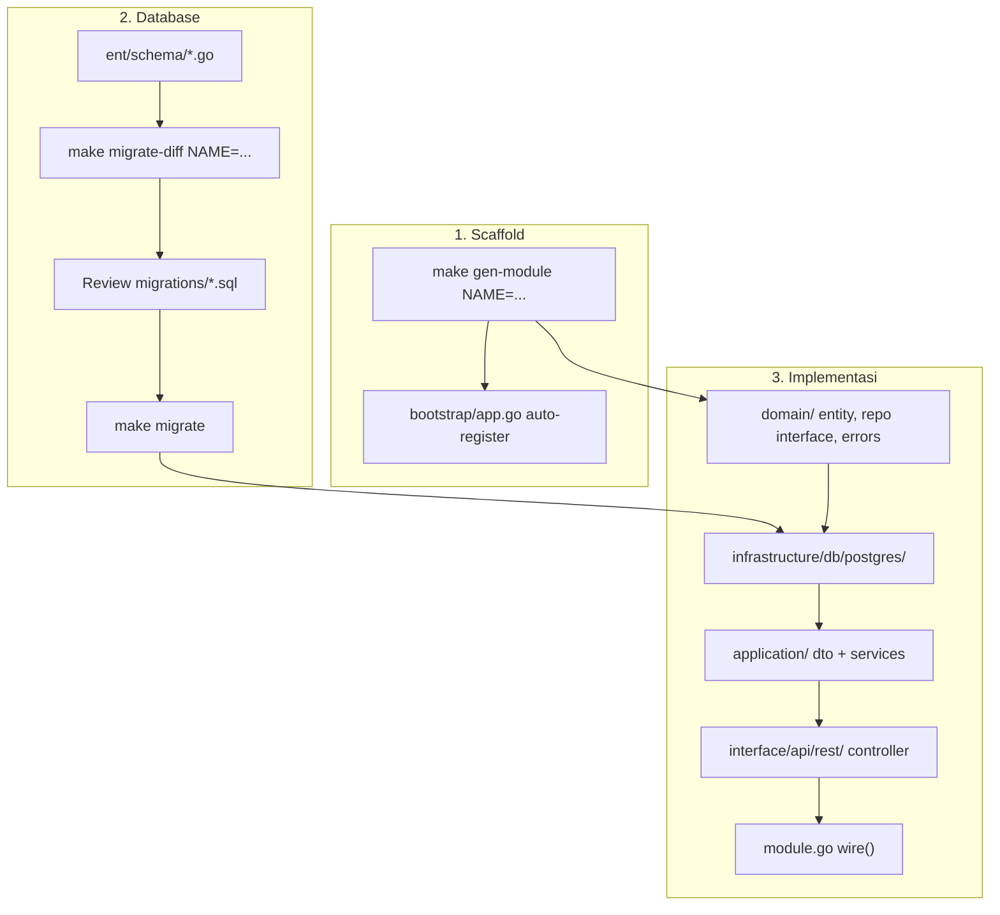

# Panduan Membuat Bounded Context Baru

Dokumen ini menjelaskan alur lengkap menambah modul (bounded context) baru di Radius Backend — dari scaffold generator, schema Ent, migrasi, hingga endpoint HTTP.

**Referensi terkait:**

- [AGENTS.md](../AGENTS.md) — aturan arsitektur DDD, layer, dan konvensi API
- [ENT.md](./ENT.md) — detail Ent schema, migrasi Atlas, repository, troubleshooting

---

## Daftar isi

1. [Ringkasan alur](#ringkasan-alur)
2. [Prasyarat](#prasyarat)
3. [Langkah 1 — Scaffold modul](#langkah-1--scaffold-modul)
4. [Langkah 2 — Schema Ent](#langkah-2--schema-ent)
5. [Langkah 3 — Generate client & migrasi](#langkah-3--generate-client--migrasi)
6. [Langkah 4 — Domain layer](#langkah-4--domain-layer)
7. [Langkah 5 — Infrastructure (postgres)](#langkah-5--infrastructure-postgres)
8. [Langkah 6 — Application layer](#langkah-6--application-layer)
9. [Langkah 7 — HTTP controller](#langkah-7--http-controller)
10. [Langkah 8 — Wire di module.go](#langkah-8--wire-di-modulego)
11. [Transaksi database](#transaksi-database)
12. [Endpoint dengan pagination](#endpoint-dengan-pagination)
13. [Testing & verifikasi](#testing--verifikasi)
14. [Checklist](#checklist)
15. [Contoh walkthrough: modul `invoices`](#contoh-walkthrough-modul-invoices)

---

## Ringkasan alur



Urutan yang disarankan:

| # | Apa | Perintah / lokasi |
|---|-----|-------------------|
| 1 | Scaffold folder + hello endpoint | `make gen-module NAME=invoices` |
| 2 | Definisikan tabel di Ent | `ent/schema/invoice.go` |
| 3 | Generate SQL migrasi | `make migrate-diff NAME=add_invoices` |
| 4 | Apply ke DB dev | `make migrate` atau `make up` |
| 5 | Isi domain, repository, service, controller | `internal/invoices/...` |
| 6 | Wire dependency | `internal/invoices/module.go` |
| 7 | Test | `make test`, `curl`, `/docs` |

---

## Prasyarat

- Docker stack berjalan (`make up`) atau Postgres lokal tersedia
- File env: `build/.env` (copy dari `build/.env.example`)
- Nama modul: huruf kecil, angka, underscore — regex `^[a-z][a-z0-9_]*$`
  - `invoices` → package `invoices`, type `Invoices`, path `/invoices/...`
  - `work_orders` → package `work_orders`, type `WorkOrders`

**Konvensi penamaan:**

| Item | Contoh |
|------|--------|
| Folder modul | `internal/invoices/` |
| Package Go | `invoices` |
| Ent schema struct | `Invoice` (singular PascalCase) |
| Tabel Postgres | `invoices` (plural snake_case) |
| Service method | `HandleCreateInvoice`, `HandleListInvoices` |
| Operation ID | `invoices-create`, `invoices-list` |
| API path | `/invoices`, `/invoices/{invoiceId}` (tanpa prefix `/v1`) |

---

## Langkah 1 — Scaffold modul

Generator membuat struktur bounded context minimal dan mendaftarkan modul ke bootstrap.

```bash
make gen-module NAME=invoices
```

**Yang dihasilkan:**

```
internal/invoices/
├── module.go
├── domain/
│   ├── errors.go          # stub + TODO
│   ├── entity.go          # stub entity
│   ├── repository.go      # stub interface
│   └── transaction.go     # stub tx bundle
├── application/
│   ├── dto/hello.go
│   └── services/invoices_service.go   # HandleHello → "hello world"
├── interface/api/rest/invoices_controller.go
└── infrastructure/db/postgres/.gitkeep
```

**Bootstrap** (`internal/bootstrap/app.go`) otomatis ditambah:

- import `github.com/radius/radius-backend/internal/invoices`
- `invoices.NewModule(),` di slice `contexts`

**Verifikasi cepat** (endpoint placeholder public):

```bash
make run
curl -s http://localhost:8080/invoices/hello
```

Response envelope:

```json
{
  "isSuccess": true,
  "message": "OK",
  "data": { "message": "hello world" }
}
```

OpenAPI dev: `http://localhost:8080/docs`

> Generator ada di [`scripts/gen-module.sh`](../scripts/gen-module.sh). Template di [`scripts/templates/module/`](../scripts/templates/module/).

---

## Langkah 2 — Schema Ent

Sumber kebenaran schema database ada di `ent/schema/`. **Jangan** edit file generated di `ent/` (kecuali `ent/schema/`).

### Contoh schema baru

Buat `ent/schema/invoice.go` (lihat pola di [`ent/schema/workspace.go`](../ent/schema/workspace.go)):

```go
package schema

import (
	"time"

	"entgo.io/ent"
	"entgo.io/ent/dialect"
	"entgo.io/ent/dialect/entsql"
	"entgo.io/ent/schema"
	"entgo.io/ent/schema/edge"
	"entgo.io/ent/schema/field"
	"entgo.io/ent/schema/index"
)

type Invoice struct {
	ent.Schema
}

func (Invoice) Annotations() []schema.Annotation {
	return []schema.Annotation{
		entsql.Annotation{Table: "invoices"},
	}
}

func (Invoice) Fields() []ent.Field {
	return []ent.Field{
		field.String("id").
			SchemaType(map[string]string{dialect.Postgres: "uuid"}).
			Default("gen_random_uuid()").
			Immutable(),
		field.String("workspace_id").
			SchemaType(map[string]string{dialect.Postgres: "uuid"}).
			NotEmpty(),
		field.String("number").
			SchemaType(map[string]string{dialect.Postgres: "varchar(64)"}).
			NotEmpty(),
		field.Int("amount_cents").
			NonNegative(),
		field.Enum("status").
			Values("draft", "sent", "paid", "void").
			Default("draft"),
		field.Time("created_at").
			Default(time.Now).
			Immutable(),
		field.Time("updated_at").
			Default(time.Now).
			UpdateDefault(time.Now),
	}
}

func (Invoice) Edges() []ent.Edge {
	return []ent.Edge{
		edge.From("workspace", Workspace.Type).
			Ref("invoices").
			Field("workspace_id").
			Unique().
			Required().
			Annotations(entsql.OnDelete(entsql.Cascade)),
	}
}

func (Invoice) Indexes() []ent.Index {
	return []ent.Index{
		index.Fields("workspace_id", "number").Unique(),
	}
}
```

Jika menambah edge baru di schema yang sudah ada (mis. `Workspace`), tambahkan juga di file schema terkait:

```go
// ent/schema/workspace.go — di Edges()
edge.To("invoices", Invoice.Type).
    Annotations(entsql.OnDelete(entsql.Cascade)),
```

### Pola field umum

| Kebutuhan | Ent |
|-----------|-----|
| UUID PK + default DB | `.SchemaType(..., "uuid")` + `.Default("gen_random_uuid()")` + `.Immutable()` |
| FK UUID | `field.String("workspace_id").SchemaType(..., "uuid").NotEmpty()` |
| Nullable | `.Optional().Nillable()` |
| Soft delete | `field.Time("deleted_at").Optional().Nillable()` + filter `DeletedAtIsNil` di repo |
| Email case-insensitive | tipe `citext` — lihat [ENT.md](./ENT.md#email-case-insensitive-citext) |
| Unique constraint | `index.Fields(...).Unique()` atau `.Unique()` pada field |

Detail lebih lanjut: [ENT.md — Menulis schema Ent](./ENT.md#menulis-schema-ent).

---

## Langkah 3 — Generate client & migrasi

### Generate diff SQL

```bash
make migrate-diff NAME=add_invoices
```

Perintah ini secara berurutan:

1. `make ent-generate` — regenerate client Ent di `ent/`
2. Pastikan DB dev `radius_dev` ada + extension `citext`
3. Menulis file baru di `migrations/<timestamp>_add_invoices.sql`
4. Update `migrations/atlas.sum`

### Review SQL (wajib)

Buka file SQL baru di `migrations/` dan periksa:

- `CREATE TABLE` / `ALTER` sesuai harapan
- Tidak ada `DROP` yang tidak disengaja
- Kolom `NOT NULL` baru punya `DEFAULT` atau strategi backfill
- FK dan index benar

### Apply migrasi

```bash
make migrate
```

Atau naikkan stack penuh (migrate + app):

```bash
make up
```

DB aplikasi: `radius` (`RADIUS_DATABASE_NAME`). DB `radius_dev` hanya untuk diff.

Jika edit SQL manual:

```bash
make migrate-hash
```

---

## Langkah 4 — Domain layer

Domain **tidak** mengimpor Ent, Echo, atau Huma. JSON tags hanya di `application/dto/`.

### Entity — `domain/invoice.go`

Ganti stub `entity.go` atau tambah file entity terpisah:

```go
package domain

import "time"

type Invoice struct {
	ID          string
	WorkspaceID string
	Number      string
	AmountCents int
	Status      InvoiceStatus
	CreatedAt   time.Time
	UpdatedAt   time.Time
}

type InvoiceStatus string

const (
	InvoiceStatusDraft InvoiceStatus = "draft"
	InvoiceStatusSent  InvoiceStatus = "sent"
	InvoiceStatusPaid  InvoiceStatus = "paid"
	InvoiceStatusVoid  InvoiceStatus = "void"
)
```

### Errors — `domain/errors.go`

```go
package domain

import "errors"

var (
	ErrInvoiceNotFound        = errors.New("invoice not found")
	ErrInvoiceNumberExists    = errors.New("invoice number already exists")
	ErrInvoiceForbidden       = errors.New("invoice forbidden")
)
```

### Repository interface — `domain/repository.go`

Ikuti pola [`internal/workspaces/domain/repository.go`](../internal/workspaces/domain/repository.go):

```go
package domain

import (
	"context"

	"github.com/radius/radius-backend/internal/shared/pagination"
)

type InvoiceFields int

const (
	InvoiceFieldsAll     InvoiceFields = iota
	InvoiceFieldsProfile               // kolom untuk list/detail
	InvoiceFieldsExists                // id only
)

type InvoiceFilter struct {
	ID          *string
	WorkspaceID *string
	Search      string // partial match pada number
}

type InvoiceQuery struct {
	Select InvoiceFields
	Filter InvoiceFilter
}

type InvoiceUpdateData struct {
	Number      *string
	AmountCents *int
	Status      *InvoiceStatus
}

type InvoiceRepository interface {
	Create(ctx context.Context, invoice *Invoice) error
	FindByID(ctx context.Context, id string, fields ...InvoiceFields) (*Invoice, error)
	FindOne(ctx context.Context, q InvoiceQuery) (*Invoice, error)
	FindManyPaginate(ctx context.Context, q InvoiceQuery, params pagination.Params) (*pagination.Result[*Invoice], error)
	UpdateByID(ctx context.Context, id string, data InvoiceUpdateData) error
	DeleteByID(ctx context.Context, id string) error
}
```

### Transaction bundle — `domain/transaction.go`

Untuk operasi multi-write atomik dalam satu modul:

```go
package domain

import "context"

type InvoicesRepositories struct {
	Invoices InvoiceRepository
}

type RunInvoicesInTransactionFunc func(
	ctx context.Context,
	fn func(ctx context.Context, repos InvoicesRepositories) error,
) error
```

---

## Langkah 5 — Infrastructure (postgres)

Semua akses Ent hanya di `infrastructure/db/postgres/`.

### File yang dibuat

| File | Fungsi |
|------|--------|
| `ent_invoice_repository.go` | Implementasi `domain.InvoiceRepository` |
| `mapper.go` | `*ent.Invoice` ↔ `domain.Invoice` |
| `constraints.go` | Map `pq.Error` unique → domain error |

### Mapper

```go
package postgres

import (
	"github.com/radius/radius-backend/ent"
	"github.com/radius/radius-backend/internal/invoices/domain"
)

func toDomainInvoice(row *ent.Invoice) *domain.Invoice {
	return &domain.Invoice{
		ID:          row.ID,
		WorkspaceID: row.WorkspaceID,
		Number:      row.Number,
		AmountCents: row.AmountCents,
		Status:      domain.InvoiceStatus(row.Status),
		CreatedAt:   row.CreatedAt,
		UpdatedAt:   row.UpdatedAt,
	}
}
```

### Repository (cuplikan)

Lihat implementasi lengkap di [`ent_workspace_repository.go`](../internal/workspaces/infrastructure/db/postgres/ent_workspace_repository.go).

```go
type InvoiceRepository struct {
	client *ent.Client
}

func NewInvoiceRepository(client *ent.Client) *InvoiceRepository {
	return &InvoiceRepository{client: client}
}

var _ domain.InvoiceRepository = (*InvoiceRepository)(nil)

func (r *InvoiceRepository) Create(ctx context.Context, inv *domain.Invoice) error {
	created, err := r.client.Invoice.Create().
		SetID(inv.ID).
		SetWorkspaceID(inv.WorkspaceID).
		SetNumber(inv.Number).
		SetAmountCents(inv.AmountCents).
		SetStatus(entinvoice.Status(inv.Status)).
		Save(ctx)
	if err != nil {
		if mapped := mapInvoiceSaveError(err); mapped != err {
			return mapped
		}
		return fmt.Errorf("create invoice: %w", err)
	}
	inv.CreatedAt = created.CreatedAt
	inv.UpdatedAt = created.UpdatedAt
	return nil
}

func (r *InvoiceRepository) FindByID(ctx context.Context, id string, fields ...domain.InvoiceFields) (*domain.Invoice, error) {
	row, err := r.client.Invoice.Query().
		Where(entinvoice.IDEQ(id)).
		First(ctx)
	if err != nil {
		if ent.IsNotFound(err) {
			return nil, domain.ErrInvoiceNotFound
		}
		return nil, fmt.Errorf("find invoice: %w", err)
	}
	return toDomainInvoice(row), nil
}
```

### Constraint mapping

```go
func mapInvoiceSaveError(err error) error {
	if !ent.IsConstraintError(err) {
		return err
	}
	if isUniqueInvoiceNumber(err) {
		return domain.ErrInvoiceNumberExists
	}
	return err
}
```

---

## Langkah 6 — Application layer

### DTO — `application/dto/invoice.go`

JSON / Huma tags **hanya** di sini:

```go
package dto

import (
	"time"

	"github.com/radius/radius-backend/internal/invoices/domain"
	"github.com/radius/radius-backend/internal/shared/pagination"
)

type InvoiceResponse struct {
	ID          string `json:"id"`
	WorkspaceID string `json:"workspaceId"`
	Number      string `json:"number"`
	AmountCents int    `json:"amountCents"`
	Status      string `json:"status"`
	CreatedAt   string `json:"createdAt"`
	UpdatedAt   string `json:"updatedAt"`
}

func MapInvoice(inv *domain.Invoice) InvoiceResponse {
	return InvoiceResponse{
		ID:          inv.ID,
		WorkspaceID: inv.WorkspaceID,
		Number:      inv.Number,
		AmountCents: inv.AmountCents,
		Status:      string(inv.Status),
		CreatedAt:   inv.CreatedAt.UTC().Format(time.RFC3339),
		UpdatedAt:   inv.UpdatedAt.UTC().Format(time.RFC3339),
	}
}

type CreateInvoiceInput struct {
	Body struct {
		Number      string `json:"number" minLength:"1"`
		AmountCents int    `json:"amountCents" minimum:"0"`
	}
}

type ListInvoicesInput struct {
	WorkspaceID string `path:"workspaceId" format:"uuid"`
	pagination.HTTPQuery
}

func (in ListInvoicesInput) Params() pagination.Params {
	return in.HTTPQuery.ParamsWithSort("createdAt", "createdAt", "updatedAt", "number", "status")
}
```

### Service — `application/services/invoice_service.go`

Satu method publik per use case HTTP: `Handle{Action}`.

```go
func (s *InvoiceService) HandleCreateInvoice(
	ctx context.Context,
	workspaceID string,
	number string,
	amountCents int,
) (*dto.InvoiceResponse, error) {
	inv := &domain.Invoice{
		ID:          uuid.NewString(),
		WorkspaceID: workspaceID,
		Number:      strings.TrimSpace(number),
		AmountCents: amountCents,
		Status:      domain.InvoiceStatusDraft,
	}
	if err := s.invoiceRepo.Create(ctx, inv); err != nil {
		return nil, err
	}
	out := dto.MapInvoice(inv)
	return &out, nil
}
```

Hapus atau ganti endpoint hello placeholder setelah endpoint nyata siap.

---

## Langkah 7 — HTTP controller

File: `interface/api/rest/invoice_controller.go`

Pola registrasi (lihat [`workspace_controller.go`](../internal/workspaces/interface/api/rest/workspace_controller.go)):

```go
var invoiceErrors = []humaapi.ErrorMapping{
	{Err: domain.ErrInvoiceNotFound, Status: http.StatusNotFound, Code: "invoice_not_found", Message: "Invoice not found.", Param: "invoiceId"},
	{Err: domain.ErrInvoiceNumberExists, Status: http.StatusConflict, Code: "invoice_number_exists", Message: "Invoice number already exists.", Param: "number"},
}

func RegisterInvoices(api huma.API, svc *services.InvoiceService, auth *middleware.AuthMiddleware, logger *zap.Logger) {
	authMW := humaapi.RequireAuth(auth, api)

	// Literal path sebelum path parameter
	huma.Register(api, huma.Operation{
		OperationID: "invoices-list",
		Method:      http.MethodGet,
		Path:        "/workspaces/{workspaceId}/invoices",
		Summary:     "List invoices in a workspace",
		Tags:        []string{"invoices"},
		Security:    humaapi.BearerSecurity(),
		Middlewares: huma.Middlewares{authMW},
	}, func(ctx context.Context, in *dto.ListInvoicesInput) (*humaapi.OKOutput, error) {
		userID, err := humaapi.UserIDFromContext(ctx)
		if err != nil {
			return nil, err
		}
		_ = userID // TODO: cek membership workspace
		page, err := svc.HandleListInvoices(ctx, in.WorkspaceID, in.Params())
		if err != nil {
			return nil, humaapi.MapError(err, invoiceErrors, logger)
		}
		return humaapi.OK(page), nil
	})
}
```

**Konvensi response:**

| Aksi | Helper |
|------|--------|
| GET / PATCH success | `humaapi.OK(data)` |
| POST create | `humaapi.Created(data)` |
| Domain error | `humaapi.MapError(err, mappings, logger)` |

**Auth:**

- Protected: `Security: humaapi.BearerSecurity()`, `Middlewares: humaapi.RequireAuth(auth, api)`
- Public (health, hello scaffold): tanpa Security/Middlewares

---

## Langkah 8 — Wire di module.go

Ganti stub `wire()` di [`module.go`](../internal/workspaces/module.go) (contoh workspaces):

```go
func (m *Module) wire(deps module.Dependencies) {
	if m.invoiceSvc != nil {
		return
	}

	invoiceRepo := postgres.NewInvoiceRepository(deps.Ent)

	runInvoicesTx := func(ctx context.Context, fn func(context.Context, domain.InvoicesRepositories) error) error {
		return deps.RunInTransaction(ctx, func(ctx context.Context, tx *ent.Client) error {
			return fn(ctx, domain.InvoicesRepositories{
				Invoices: postgres.NewInvoiceRepository(tx),
			})
		})
	}

	m.invoiceSvc = services.NewInvoiceService(invoiceRepo, runInvoicesTx, deps.Logger)
}

func (m *Module) RegisterHTTP(_ *echo.Echo, api huma.API, deps module.Dependencies, auth *middleware.AuthMiddleware) {
	m.wire(deps)
	rest.RegisterInvoices(api, m.invoiceSvc, auth, deps.Logger)
}
```

`module.go` adalah **composition root** modul — boleh import `infrastructure/db/postgres`, tapi `application/services` tidak boleh import postgres/ent.

---

## Transaksi database

Gunakan `deps.RunInTransaction` (di-wire sebagai `module.Dependencies.RunInTransaction`) untuk operasi multi-write atomik.

**Aturan:**

- Callback transaksi **pendek** — hanya operasi DB (tanpa HTTP, OAuth, sleep)
- Jangan nested `RunInTransaction`
- OAuth exchange tetap di luar transaksi
- Build repo dari `tx *ent.Client` di dalam callback

Contoh multi-write (create workspace + owner member): [`workspace_service.go`](../internal/workspaces/application/services/workspace_service.go) method `HandleCreateWorkspace`.

Cross-context orchestration (beberapa bounded context, satu TX): lihat `internal/coordination/`.

---

## Endpoint dengan pagination

1. Embed `pagination.HTTPQuery` di list input DTO
2. Method `Params()` dengan allowlist sort field
3. Repository `FindManyPaginate` → `*pagination.Result[*domain.Invoice]`
4. Service return `pagination.Map(page, dto.MapInvoice)` atau langsung ke controller

Detail: [AGENTS.md — Pagination](../AGENTS.md#6-pagination-internalsharedpagination).

---

## Testing & verifikasi

```bash
# Unit test
make test

# Build
make build

# Manual API
make run
curl -s http://localhost:8080/docs          # OpenAPI UI (non-production)
curl -s http://localhost:8080/openapi.yaml

# Protected endpoint
TOKEN="..." # dari POST /auth/login
curl -s -H "Authorization: Bearer $TOKEN" \
  http://localhost:8080/workspaces/{workspaceId}/invoices
```

---

## Checklist

Gunakan checklist ini setiap modul baru:

- [ ] `make gen-module NAME=...` — scaffold + bootstrap
- [ ] `ent/schema/*.go` — definisi tabel & relasi
- [ ] Edge balik di schema terkait (jika ada FK)
- [ ] `make migrate-diff NAME=...` — review SQL
- [ ] `make migrate` — apply ke DB
- [ ] `domain/` — entity, errors, repository interface, transaction (jika perlu)
- [ ] `infrastructure/db/postgres/` — repository, mapper, constraints
- [ ] `application/dto/` — input/output HTTP
- [ ] `application/services/` — `Handle*` methods
- [ ] `interface/api/rest/` — `huma.Register` + error mappings
- [ ] `module.go` — wire repos + tx + panggil `Register*`
- [ ] Hapus/ganti endpoint hello placeholder
- [ ] `make test` + smoke test endpoint
- [ ] (Opsional) Update daftar endpoint di AGENTS.md

---

## Contoh walkthrough: modul `invoices`

```bash
# 1. Scaffold
make gen-module NAME=invoices
curl http://localhost:8080/invoices/hello   # placeholder OK

# 2. Tulis ent/schema/invoice.go (+ edge di workspace.go)

# 3. Migrasi
make migrate-diff NAME=add_invoices
# review migrations/*_add_invoices.sql
make migrate

# 4. Implement domain → postgres → service → controller
# 5. Wire module.go
# 6. Test
make test
make run
```

**Struktur akhir** (setelah implementasi penuh):

```
internal/invoices/
├── module.go
├── domain/
│   ├── invoice.go
│   ├── errors.go
│   ├── repository.go
│   └── transaction.go
├── application/
│   ├── dto/
│   │   └── invoice.go
│   └── services/
│       └── invoice_service.go
├── infrastructure/db/postgres/
│   ├── ent_invoice_repository.go
│   ├── mapper.go
│   └── constraints.go
└── interface/api/rest/
    └── invoice_controller.go

ent/schema/
└── invoice.go

migrations/
└── <timestamp>_add_invoices.sql
```

---

## Troubleshooting

| Masalah | Solusi |
|---------|--------|
| `make gen-module` — folder sudah ada | Pilih nama lain atau hapus folder lama |
| `migrate-diff` tidak menghasilkan file | Pastikan schema benar-benar berubah; lihat [ENT.md — Troubleshooting](./ENT.md#troubleshooting) |
| Checksum mismatch | `make migrate-hash` |
| Import cycle | Pastikan domain tidak import application/infrastructure |
| Ent type tidak ditemukan | `make ent-generate` |
| DB fresh setelah format migrasi berubah | `make down`, hapus volume postgres, `make up` |

---

## Perintah cepat

| Perintah | Fungsi |
|----------|--------|
| `make gen-module NAME=x` | Scaffold bounded context |
| `make ent-generate` | Regenerate client Ent |
| `make migrate-diff NAME=x` | SQL migrasi baru dari schema |
| `make migrate` | Apply migrasi ke DB aplikasi |
| `make migrate-hash` | Perbarui `atlas.sum` |
| `make test` | Jalankan test |
| `make run` | Jalankan API lokal |
| `make up` | Docker stack + migrate + app |
